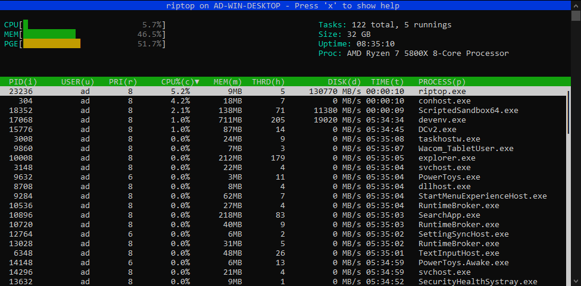

# riptop

A simple `htop` clone to accustom myself to modern C++.



## Operating systems

* Windows 10 x64 only.

## Usage

Run `riptop.exe`.

Press 'q' for exiting.

Press 'x' to show help.

### Move in process list
- Up or 'k' key for going up.
- Down or 'j' key for going down.
- Home go to start of list.
- End go to end of list.

### Column sorting
- Press key in parenthesis in column name 
- Press again to change sorting order

### Search process by name

1. Press '/' to show search bar. 
2. Enter process name and press RETURN.
3. ESCAPE for closing search bar.


## Build instructions:

Tested with Visual Studio 2019.

```powershell
mkdir build
cd build
cmake ..
cmake --build .
```

## Architecture overview

```shell
main -->-->-----UI thread ----------->------------------- Receives probes data -->-- Render -->-- Handle Inputs ---
        \                                                        |     |
         \                                                       ^     ^
          \                                  system_info_channel |     | processes_channel
           \                                                     ^     ^  
            \                                                     \   /
             `--Acquisition thread -->-- Acquire all probes -->-- Send probes data to UI --------------------------

```

## External dependencies

* [FTXUI library](https://github.com/ArthurSonzogni/ftxui) for terminal UI.
* [WIL (Windows Implementation Libraries)](https://github.com/microsoft/wil) for accessing Windows API in a modern safe C++ way.
* [Catch2](https://github.com/catchorg/Catch2) for unit tests.


## Similar projects and inspiration

* [NTop](https://github.com/gsass1/NTop) written in C.
* [bottom](https://github.com/clementtsang/bottom) written in Rust.

